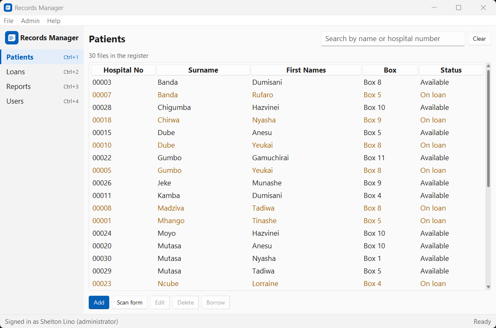
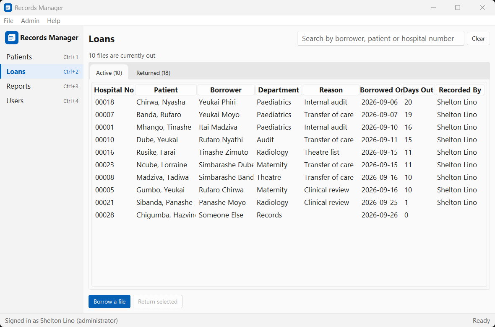
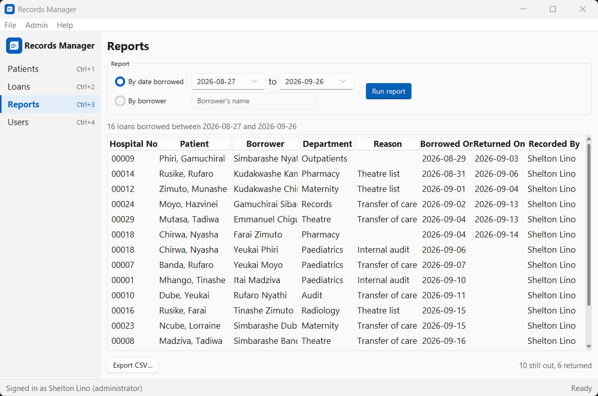
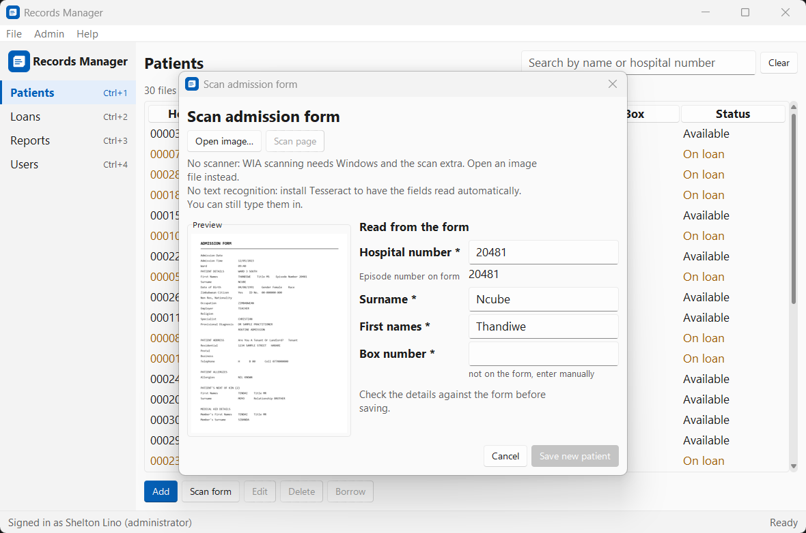
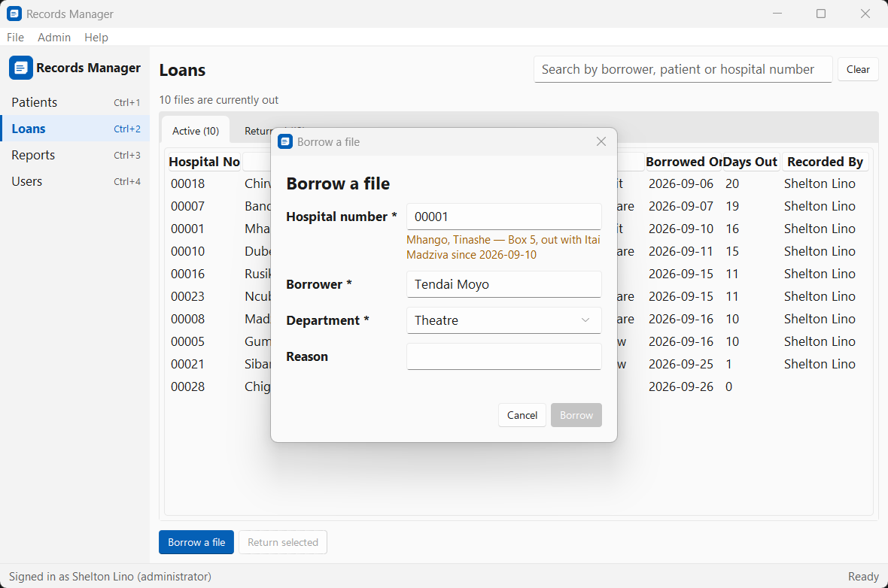

# Records Manager

Desktop software for a hospital records office: track where every patient
file is, who has it, and when it comes back.



Paper files still run most records offices. This keeps the register in one
place — who is on file, which box a file lives in, who borrowed it and when
— and reads new admission forms off the scanner so they do not have to be
typed twice.

## Features

- **Patient register** — search by name or hospital number as you type, add,
  edit and delete. Hospital numbers are text, so `00123` stays `00123`.
- **Borrowing and returns** — one file, one active loan. Typing a number to
  borrow resolves it against the register first, so a file cannot be booked
  out against the wrong record or while somebody already has it.
- **Scan and read admission forms** — open an image or scan a page, review
  what was read off it, then save. Nothing reaches the database unreviewed.
- **Reports** — by date range or by borrower, previewed on screen and
  exported to CSV.
- **Accounts** — scrypt-hashed passwords, no default account, and the last
  administrator cannot be deleted.

| | |
|---|---|
|  |  |
| Files currently out, longest first | A report ready to export |
|  |  |
| A form read and waiting for review | A file that is already out |

More in [`docs/screenshots/`](docs/screenshots).

## Install

Python 3.10 or newer. Tkinter and SQLite come with Python.

```bash
git clone https://github.com/Shelaz01/tkinter_records_management.git
cd tkinter_records_management
python -m venv .venv && .venv/Scripts/activate   # Linux/macOS: source .venv/bin/activate
pip install .
```

For development, install in place with the test dependencies:

```bash
pip install -e ".[dev]"
```

### Scanning and OCR (optional)

The application runs without either — the scan features explain what is
missing and stay out of the way.

```bash
pip install -e ".[scan]"
```

That brings in `pytesseract`, `opencv-python-headless` and, on Windows,
`pywin32` for the scanner. Tesseract itself is a separate program:

- **Windows** — install from [UB Mannheim's
  builds](https://github.com/UB-Mannheim/tesseract/wiki), then either add it
  to `PATH` or set `TESSERACT_CMD` to `tesseract.exe`.
- **Debian/Ubuntu** — `sudo apt install tesseract-ocr`
- **macOS** — `brew install tesseract`

Scanning uses Windows Image Acquisition and so is Windows-only. Everywhere
else, open a scanned image from disk instead.

## Run

```bash
python -m records_manager
```

The first run has no accounts, so it asks you to create an administrator.
The database is created at `~/.records_manager/records.db`; pass
`--db PATH` to put it somewhere else.

To try it with data, fill a database with fictional patients and loans:

```bash
python -m records_manager --seed-demo --db demo.db
python -m records_manager --db demo.db
```

## Tests

```bash
pip install -e ".[dev]"
pytest
```

230 tests, none of which need a scanner, Tesseract or a display. The OCR
tests run against captured form text in `tests/fixtures/`.

## How it works

Three layers, each only talking to the one below it:

```
  ui/          Tkinter views and dialogs
    |          catch RecordsError, show str(err), never write SQL
    v
  db.py        UserRepo, PatientRepo, LoanRepo
    |          the only place SQL is written
    v
  SQLite       users, patients, loans
```

The user interface never imports `sqlite3`. Every repository call it makes
is wrapped so that a `RecordsError` becomes a message on screen rather than
a traceback, and the data layer turns SQLite's constraint violations into
errors that say what went wrong: a duplicate hospital number, a file already
borrowed, a file whose history stops it being deleted.

**One loans table.** A loan is active while `returned_on IS NULL`, and a
partial unique index enforces one active loan per file — the database
refuses a double borrow rather than trusting the interface to prevent it.

**Hospital numbers are `TEXT`.** `00123` and `123` are different files.
Table rows are keyed by that string and selections are read back from a
dict, never from the Treeview, which would hand back `123`.

### The OCR pipeline

```
  image ──► preprocess ──► extract_text ──► parse_fields ──► review form
            greyscale       Tesseract        pure function     you check it
            + Otsu          --psm 6          no I/O            before saving
```

`parse_fields` is a pure function over text, which is why it can be tested
without Tesseract installed. It returns `None` for anything it could not
read rather than a placeholder, so the interface can tell "not found" from a
value worth reviewing.

The admission form's episode number carries the admission on the end:
`A10619:2` is file `10619`, admission `2`. Those are kept apart — run
together they read as file `106192`, which belongs to somebody else — and
the scan is filed as `10619_2.png` so a later admission cannot overwrite it.

## Project structure

```
src/records_manager/
├── app.py              root window and screen switching
├── db.py               repositories, models, errors
├── schema.sql          tables and indexes
├── demo.py             --seed-demo
├── reports.py          CSV export, no Tkinter
├── assets/             application icons
├── scanning/
│   ├── ocr.py          preprocess, extract_text, parse_fields
│   ├── scanner.py      one page per call, via wia_scan
│   ├── filing.py       where scans are filed, and name matching
│   └── wia_scan/       vendored, unmodified
└── ui/
    ├── style.py        every font, colour and pad, defined once
    ├── widgets.py      DataTable, FormDialog, dialogs
    └── views/          patients, loans, reports, users, scan

tests/                  230 tests, fixtures under tests/fixtures/
tools/                  icon, sample form and screenshot generators
samples/                a fictional admission form to try the scan flow
```

## Licence

MIT.
